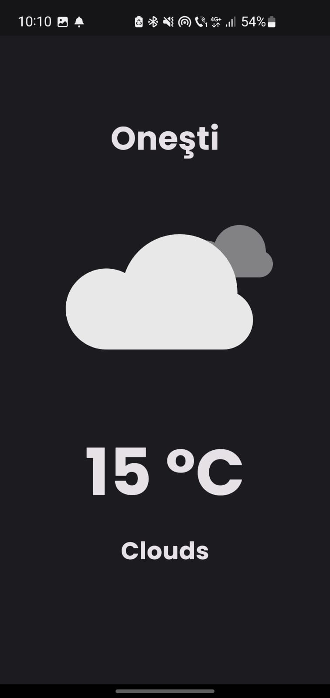
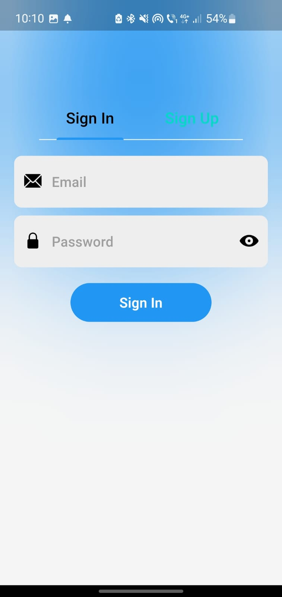
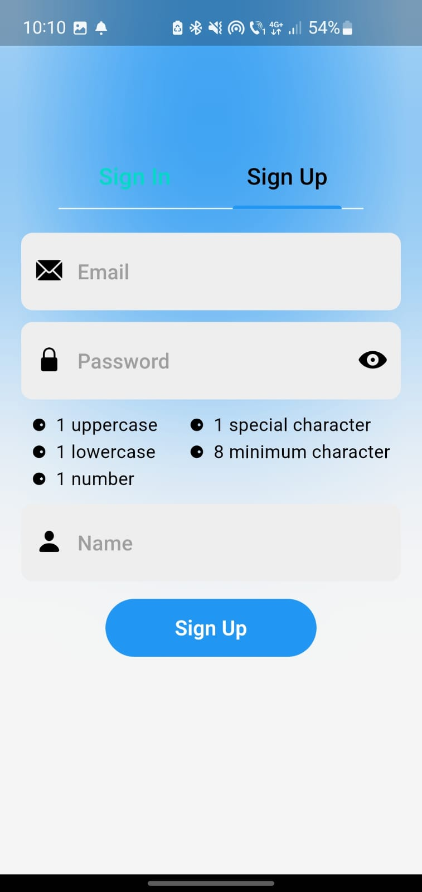
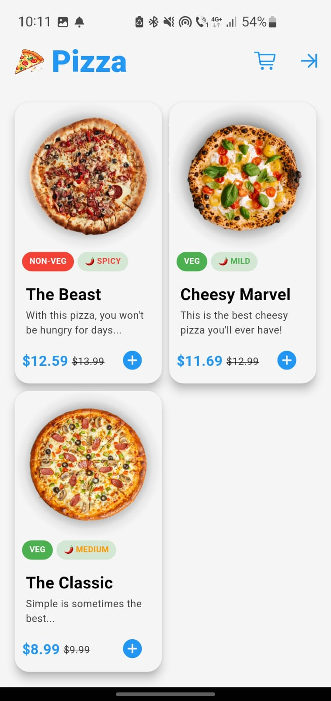

# My Flutter Journey: Apps From Zero To Hero

Welcome to my Flutter journey! This repository contains two Flutter projects that I've developed while learning Flutter development. Each project showcases different aspects of app development using Flutter.

## Projects

1. [**Minimalistic Weather App**](minimalistic_weather_app)
   - A simple weather app that displays the current location's weather forecast.
   - Features:
     - Current location detection.
     - Text-based weather forecast with corresponding weather icons.
   - Screenshots:
 
<p align="center">
  
</p>
  
2. [**Pizza App**](pizza_app)
   - A pizza ordering app with user authentication and Firestore integration.
   - Features:
     - User registration and login functionality.
     - Retrieval of pizza data from Firestore.
     - Display of pizza list using cards.
   - Screenshots:
<p align="center" style="display: flex; justify-content: center;">
    
    
    
</p>

## Getting Started

To get started with this Flutter project, follow these steps:

1. Clone this repository to your local machine:

   ```bash
   git clone https://github.com/ccaesar26/My-Flutter-Journey--Apps-From-Zero-To-Hero.git
   ```

2. Navigate to the project directory:

```bash
cd your-project-directory
```

3. Ensure that you have Flutter installed. If not, follow the official [Flutter installation instructions](https://docs.flutter.dev/get-started/install).
  
4. Run the following command to get the dependencies:

```bash
flutter pub get
```

5. Once all dependencies are fetched, you can run the app using the following command:

```bash
flutter run
```

This will launch the app in your connected device or emulator.

If you encounter any issues during setup or while running the app, refer to the project documentation or seek help from the Flutter community.

## About Me

I'm a second-year student pursuing Applied Computer Science at Transilvania University of Brasov. My passion lies in mobile app development, particularly in exploring the intricacies of Flutter. This repository is a testament to my journey in learning Flutter through the development of various apps.

## Acknowledgements

### Resources:
- **Minimalistic Weather App Tutorial**: The minimalistic weather app was developed with the help of the YouTube tutorial [Link to Tutorial](https://www.youtube.com/watch?v=yLtpMqvMgdY).
- **Pizza App Tutorial**: The pizza app was created following the guidance of the YouTube tutorial [Link to Tutorial](https://www.youtube.com/watch?v=MQ1_wPyVLVc&t=6695s).
